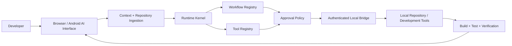

# AI Coding Studio

**AI Coding Studio is a local-first AI developer workstation that turns browser conversations into governed repository work—from context and code proposals to explicit approval and verification.**

For developers who want the speed of browser-based AI with a clear local control plane, AI Coding Studio connects a Chrome/Firefox extension and Android WebView target to a Node.js runtime that makes repository access, tool capabilities, workflow state and approvals explicit, inspectable and testable.

### Why it stands out

- **Repository-aware development:** repository and folder ingestion gives model conversations project-level context instead of isolated snippets.
- **Local authority for AI actions:** the runtime kernel, tool registry, workflow contracts and approval engine turn proposed work into structured, reviewable operations.
- **One architecture, multiple surfaces:** the same governed runtime supports Chrome, Firefox and Android-oriented delivery targets.
- **Verification is part of the loop:** build, test and verification results are returned as workflow evidence rather than treated as an afterthought.

The architecture follows a deliberate control path: browser or Android interface → repository ingestion → runtime kernel → workflow and tool registries → approval policy → authenticated Local Bridge → local repository and verification. The model can propose work; local code decides which capabilities are available and when an operation may proceed.

## Overview

AI Coding Studio explores a practical boundary between browser-based AI and a developer's local workspace. The browser extension provides the conversational surface, while the runtime layer defines explicit contracts for repository access, tools, approvals and workflows.

The project is technically interesting because model output is not treated as trusted executable intent. Repository operations pass through a local bridge, a tool registry and approval policy, allowing AI-assisted development without giving a remote model unrestricted operating-system access.

## Key Capabilities

- Chrome and Firefox browser-extension builds plus an Android WebView target.
- Repository and folder ingestion for model context.
- Local repository runtime for structured project analysis.
- Runtime kernel with explicit command-result contracts.
- Tool registry and workflow registry for controlled execution.
- Approval policy around privileged local actions.
- Structured workflow contracts for multi-step AI work.
- Persistent skills, project instructions and memory-oriented context features.
- Rich generated artifacts including HTML previews, DOCX, XLSX and PPTX.
- Voice input/output support in the conversational interface.
- Unit, architecture, browser E2E and Android-oriented test targets.

## Architecture



The design deliberately separates **reasoning** from **authority**. A model can propose work, but local capabilities remain bounded by registered tools and approval rules.

## Example Workflow

1. A developer attaches a repository or selected project files.
2. AI Coding Studio prepares repository context for the active conversation.
3. The model proposes a structured development action.
4. The runtime resolves the requested workflow and registered tool capability.
5. Approval policy decides whether local execution is permitted.
6. The Local Bridge performs the approved repository operation.
7. Build/test verification returns evidence to the development workflow.

## Tech Stack

| Area | Technology |
|---|---|
| Language | JavaScript, Kotlin (Android shell) |
| Frontend | Svelte 5, browser extension UI |
| Runtime | Node.js, Vite |
| AI | Browser-based conversational model integration |
| Documents | PptxGenJS, SheetJS, docx |
| Testing | Vitest, Playwright, Selenium |
| Infrastructure | Chrome/Firefox extension builds, Android WebView |

## Engineering Highlights

### Governed local execution
The runtime includes an approval policy, authenticated Local Bridge and explicit tool registry. This is a safer engineering pattern than translating arbitrary model text directly into shell access.

### Repository-aware AI workflows
Repository ingestion, workflow contracts and a repository runtime make the system useful for project-level reasoning rather than isolated code snippets.

### Cross-platform delivery
A shared JavaScript codebase is built for Chrome, Firefox and Android, with target-specific build and test commands.

### Verification as part of the architecture
The repository contains dedicated architecture checks and tests for command contracts, approval policy, bridge behavior, repository access, tool registration and workflow registration.

## Getting Started

### Requirements

- Node.js and npm
- Chromium or Firefox for extension development
- Android tooling only when building the Android target

```bash
npm install
npm run build
npm run check:architecture
npm run check:imports
npm run test:architecture
```

For development builds:

```bash
npm run dev
```

The build scripts also expose `build:chrome`, `build:firefox` and `build:android` targets.

## Evidence and limitations

The smallest useful local gate is `npm run test:architecture`, paired with `npm run check:architecture` and `npm run check:imports`. The broader commands are documented in [`TESTING.md`](TESTING.md): unit coverage, Chromium startup smoke, Firefox temporary-install smoke, Android WebView smoke, and Gradle tests are separate evidence lanes.

A passing build or extension-startup smoke test does not establish provider DOM compatibility, authenticated model behavior, Android release readiness, or production readiness. The repository is explicitly **in development**; use the current workflow results and the coordination record in [`docs/agents/coordination.md`](docs/agents/coordination.md) when evaluating integration status.

### Fixture-based recruiter lane

Run the bounded repository-analysis → approved-operation → verification demo with:

```bash
npm ci
npm run test:unit -- tests/recruiter-browser-first-demo.test.js
```

The test uses the checked-in [`tests/fixtures/recruiter-repository`](tests/fixtures/recruiter-repository) and the real `RepositoryRuntime`, workflow-state machine and one-shot approval engine. A stub Local Bridge returns fixture metadata, records the reviewed `patch.apply` request without mutating files, then returns a deterministic `node --test` verification result. The test proves that a write is not auto-approved, an exact approval is required and consumed, the workflow reaches `COMPLETED` only after verification, and the model/provider lane remains separately marked as not invoked.

This is focused contract evidence, not a live browser/provider or production-readiness claim. The broader unit, Chrome, Firefox and Android lanes remain separate; see [`TESTING.md`](TESTING.md) and current workflow results for their scope.

## Repository Structure

```text
src/                 Extension and runtime source
src/runtime/         Local runtime, repository, tools, safety and workflows
src/workflows/       Structured AI workflow contracts
static/              Extension static assets and manifests
scripts/             Build, validation and architecture utilities
tests/               Unit/integration/E2E test support
android/             Android WebView application target
docs/architecture/   Architecture decisions and runtime design
```

## Status

**In Development** — the repository contains a substantial working extension codebase alongside a newer governed local-development runtime. Migration away from legacy upstream naming and UI concepts is still being completed.

## Provenance

AI Coding Studio contains substantial adaptation of earlier open-source browser-extension work. The retained MIT license records the original copyright. Newer runtime architecture, workflow contracts, repository tooling and safety boundaries are developed in this repository. This provenance is stated explicitly so the project is evaluated on the engineering work actually present rather than on upstream code.

## License

MIT. See [`LICENSE`](LICENSE) for the complete license and retained copyright notice.

---

**Jason Lee**  
GitHub: [@Masterleeaus](https://github.com/Masterleeaus)
