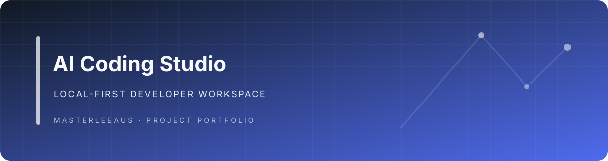
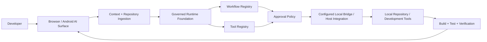

# AI Coding Studio

**AI Coding Studio brings repository context, persistent project instructions and rich generated artifacts into browser-based AI work. Its local-runtime foundation adds explicit tool contracts, approval policies and verification state for controlled development workflows.**

The project combines Chrome and Firefox extension builds, an Android WebView target and a governed Node.js runtime foundation. The conversational surfaces and local-runtime contracts are developed together, while live local-repository execution remains a separately configured host and bridge integration boundary.

## Get started

### Requirements

- Node.js and npm
- Chromium or Firefox for extension development
- Android tooling only when building the Android target

Install dependencies and run the smallest useful architecture gates:

```bash
npm ci
npm run build
npm run check:architecture
npm run check:imports
npm run test:architecture
```

For a development build:

```bash
npm run dev
```

Target-specific builds include `build:chrome`, `build:firefox` and `build:android`.

For a bounded recruiter-facing contract demo:

```bash
npm ci
npm run test:unit -- tests/recruiter-browser-first-demo.test.js
```

The demo uses the checked-in [tests/fixtures/recruiter-repository](tests/fixtures/recruiter-repository) and the real repository-runtime, workflow-state and approval contracts. Its bridge stub returns fixture metadata, records the reviewed `patch.apply` request without mutating files, and returns a deterministic `node --test` verification result.

## Why it is interesting

- **Repository-aware AI work:** repository and folder ingestion, persistent project instructions and memory-oriented context features give conversations project-level context instead of isolated snippets.
- **Useful generated artifacts:** the codebase includes document-oriented output paths for HTML previews, DOCX, XLSX and PPTX artifacts alongside the conversational interface.
- **Explicit authority boundaries:** runtime-kernel, tool-registry, workflow and approval-policy contracts make proposed operations inspectable before a configured local integration may execute them.
- **Cross-surface delivery:** the shared project targets Chrome, Firefox and Android-oriented delivery surfaces, with target-specific build and test lanes.
- **Verification state as a workflow concern:** build, test and verification results are represented as workflow evidence rather than being treated as an afterthought.

## Architecture



The design separates **reasoning** from **authority**. A model can propose work, but local capabilities remain bounded by registered tools and approval rules. The Local Bridge and host integration are not implied to be available merely because a browser or Android target is built; they require the corresponding local configuration.

## Example workflow

1. A developer attaches a repository or selected project files.
2. AI Coding Studio prepares repository context and persistent project instructions for the conversation.
3. The model proposes a structured development action.
4. The runtime resolves the requested workflow and registered tool capability.
5. Approval policy decides whether the operation may proceed.
6. A configured host/bridge integration can perform the approved repository operation; the fixture lane instead records the patch request without mutation.
7. Build or test verification returns evidence to the workflow.

## Tech stack

| Area | Technology |
|---|---|
| Language | JavaScript, Kotlin (Android shell) |
| Frontend | Svelte 5, browser extension UI |
| Runtime | Node.js, Vite |
| AI | Browser-based conversational model integration |
| Documents | PptxGenJS, SheetJS, docx |
| Testing | Vitest, Playwright, Selenium |
| Infrastructure | Chrome/Firefox extension builds, Android WebView |

## Evidence and limitations

The focused recruiter lane proves a bounded contract path: repository analysis → reviewed `patch.apply` proposal → exact approval consumption → completed workflow after deterministic verification. It deliberately stubs patch application and test execution, and does not invoke a live model/provider or claim a connected autonomous coding agent.

The broader commands are documented in [TESTING.md](TESTING.md): unit coverage, Chromium startup smoke, Firefox temporary-install smoke, Android WebView smoke and Gradle tests are separate evidence lanes. A passing build or extension-startup smoke test does not establish provider DOM compatibility, authenticated model behavior, Android release readiness, or production readiness.

The repository is **in development**. Use current workflow results and the coordination record in [docs/agents/coordination.md](docs/agents/coordination.md) when evaluating integration status.

## Repository structure

```text
src/                 Extension and runtime source
src/runtime/         Local runtime, repository, tools, safety and workflows
src/workflows/       Structured AI workflow contracts
static/              Extension static assets and manifests
scripts/             Build, validation and architecture utilities
tests/               Unit/integration/E2E test support
android/             Android WebView application target
docs/architecture/   Architecture decisions and runtime design
```

## Status

**In Development** — the repository contains a substantial working extension codebase alongside a newer governed local-development runtime. Migration away from legacy upstream naming and UI concepts is still being completed.

## Provenance

AI Coding Studio contains substantial adaptation of earlier open-source browser-extension work. The retained MIT license records the original copyright. Newer runtime architecture, workflow contracts, repository tooling and safety boundaries are developed in this repository. This provenance is stated explicitly so the project is evaluated on the engineering work actually present rather than on upstream code.

## License

MIT. See [LICENSE](LICENSE) for the complete license and retained copyright notice.

---

**Jason Lee**  
GitHub: [@Masterleeaus](https://github.com/Masterleeaus)
